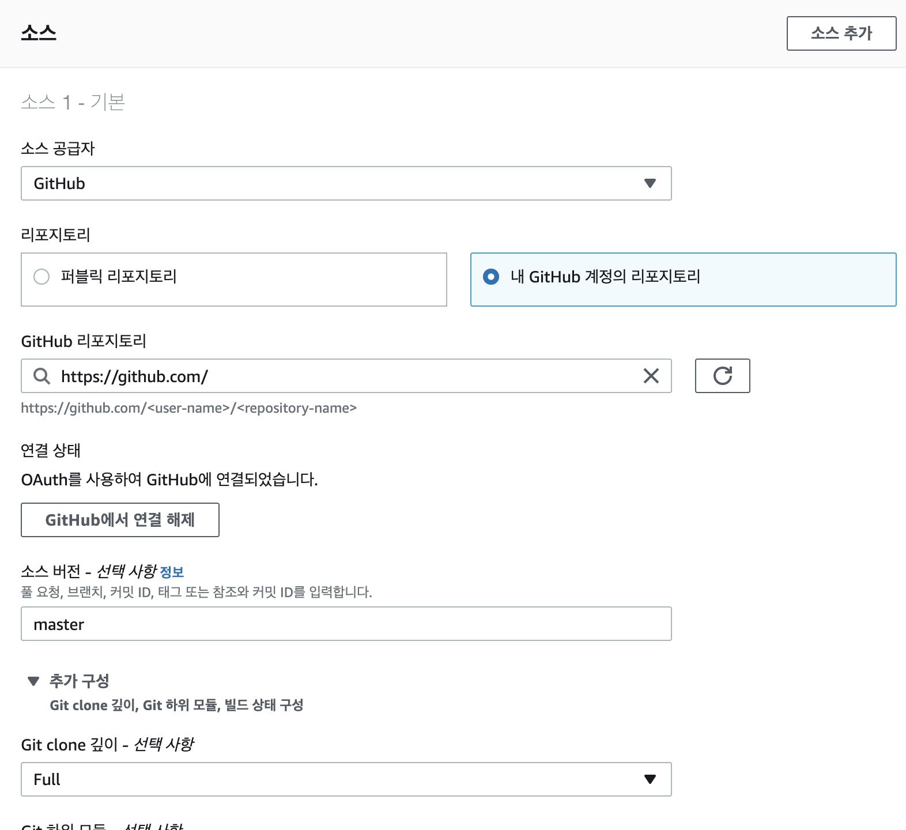
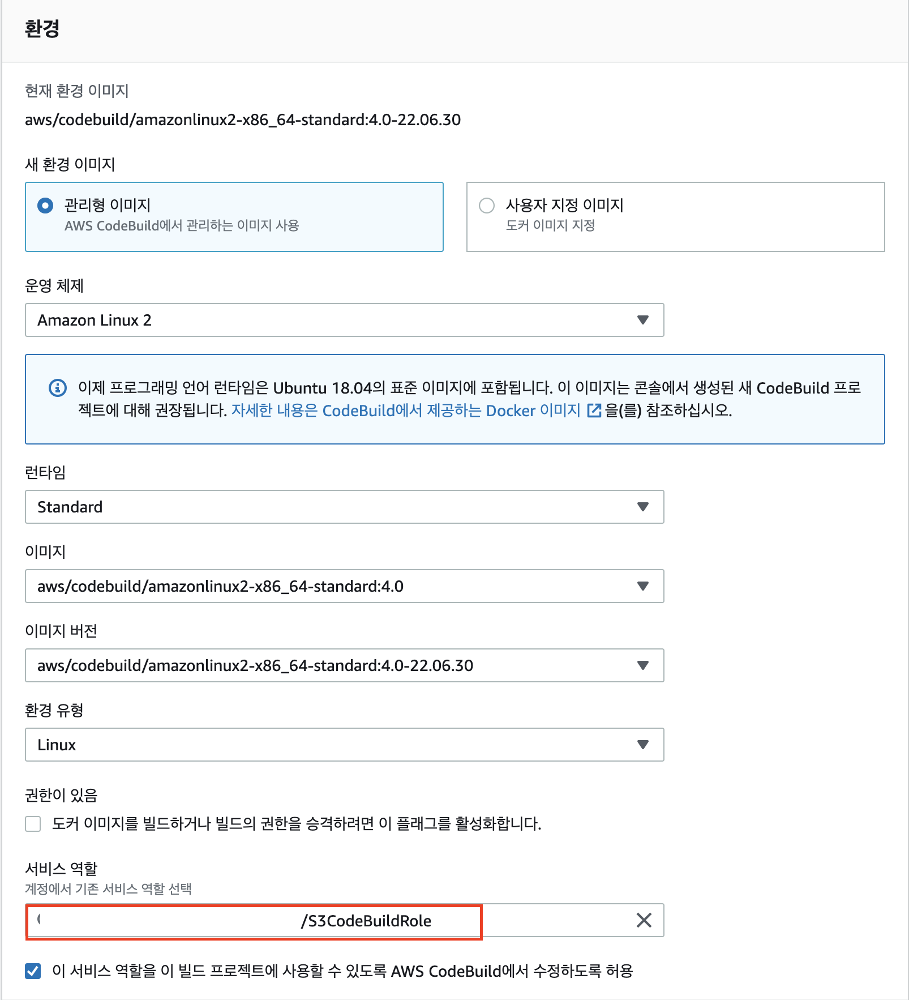

# AWS CodeBuild와 S3연동

1. github에 올린 소스 커밋
2. CodeBuild를 통한 소스 빌드
3. 빌드 산출물 s3 이동

## 준비사항

- aws 계정생성( 프리티어 )
- 사용할 IAM 사용자 생성
  - 필요한 권한
    - S3FullAccess
    - CloudWatchFullAccess
    - AWSCodeBuildDeveloperAccess
- S3 버킷 생성

  - 권한 public적용( 모두 접근 가능하게 )

    ```json
    {
      "Version": "2012-10-17",
      "Statement": [
        {
          "Sid": "AddPerm",
          "Effect": "Allow",
          "Principal": "*",
          "Action": "s3:GetObject",
          "Resource": "arn:aws:s3:::[버킷주소]/*"
        }
      ]
    }
    ```

  - 정적 웹 사이트 호스팅 활성화

- CodeBuild 생성

  - 코드를 가져올 github 설정
    
  - build환경 설정

    - 사용할 runtime과 기본 설정
      
    - 서비스 역할에 이전에 만들어 둔 역할 적용( 안 만들어도 여기서 동적으로 적용 가능 )

  - 배포설정을 위한 buildspec.yml 설정 ( aws설정 창에서 바로 적용가능 혹은 project에 buildspec.yml을 추가)

  - 아티팩트 설정은 buildsepc에서 싱크처리를 한다면 별도로 할 필요없음.

  ```yaml
  # 권장버전 현재는 .2
  version: 0.2

  # 빌드 단계별 원하는 명령 입력
  phases:
  # 빌드전 환경 설정
    install:
      runtime-versions:
        nodejs: 16
        commands: # yarn 사용 - npm install yarn -g

    # 빌드전 수행할 명령
    pre_build:
      commands: - echo build Phase >> pre_build phrase...

    # 빌드 명령
    build:
      commands:
      - echo build Phase >> build start on 'date' - yarn install - yarn run build

    # 빌드 후 실행 할 명령
    post_build:
      commands:
      # build 에러가 없을 경우 s3에 산출물 이동
        - if [ "$CODEBUILD_BUILD_SUCCEEDING" = 0 ] ; then exit 1 ; fi
        - echo build Phase >> build complete on 'date'
        # copy the contents of /build to S3
        - aws s3 sync [빌드 아웃풋 폴더]  s3://[버킷주소]/

    # 빌드 결과물로 나온 아티팩트에 처리

  artifacts:
    files: - '**/*' # - location
    #name: $(date +%Y-%m-%d)
    base-directory: [빌드 아웃풋 폴더] ( 기본 ./ )
  ```
